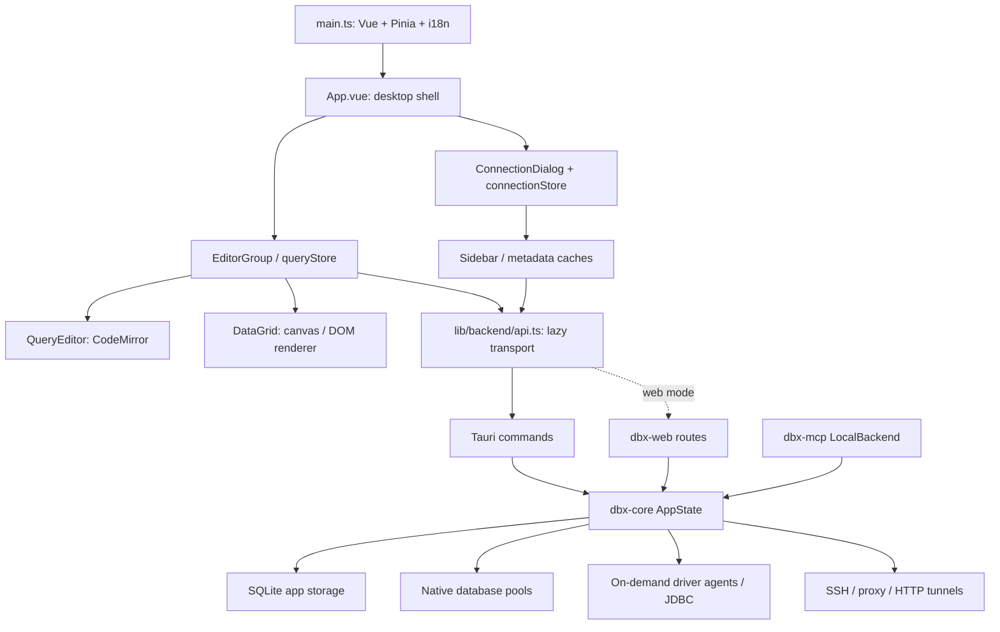

# DBX Lite: inspected architecture and implementation design

Upstream: `t8y2/dbx`, commit `8ff56b48372a013d5cbadc86e47d91cfbce800f2`, version 0.6.11.
The user's latest instruction authorizes analysis, implementation and running without an intermediate approval. **Testing must never connect to live/remote databases. Only localhost services and local SQLite fixtures are authorized.** Use a new `DBX_DATA_DIR`; never import the user's existing DBX configuration.

## Source-verified architecture

| Area | Verified source and behavior |
| --- | --- |
| Frontend entry/navigation | `apps/desktop/src/main.ts` bootstraps Vue/Pinia and dynamically imports `App.vue`. Desktop navigation is shell state and query tabs; no rewrite/router migration is needed. `App.vue` coordinates dialogs, startup restoration and optional modules. |
| State | `stores/queryStore.ts` owns tabs, result runs, execution and restoration; `connectionStore.ts` owns saved configuration and connection state; settings/history/tunnel stores are separate. |
| Query execution | `QueryEditor.vue` and layout surfaces dispatch to `queryStore`; `lib/backend/api.ts` lazily forwards to `tauri.ts` or `http.ts`; `src-tauri/src/commands/query.rs::execute_query` calls `dbx_core::query::execute_sql_statement_with_options_typed`. |
| Result transfer | Rust `db::QueryResult` crosses serde/Tauri IPC into the TS `QueryResult` model. The store already marks row arrays and Mongo document arrays raw. The grid receives the result. Frontend cache is separately encoded as columnar MessagePack, base64-wrapped for desktop persistence; this is not the query IPC format. |
| Grid | `components/grid/DataGrid.vue`, `composables/useDataGrid*`, `lib/dataGrid/canvasDataGridRenderer.ts`; canvas renderer and bounded viewport handling already exist. Do not replace the grid based on a hypothesis that it renders all 10k rows. |
| Editor/tab lifecycle | `components/layout/EditorGroup.vue` retains at most 3 hot surfaces per group via KeepAlive. `QueryEditor.vue` pauses work on deactivation and destroys CodeMirror/removes listeners before unmount. `queryStore::closeTab` cancels execution, closes result/client sessions, deletes snapshots and clears payload fields before removing the tab. This is substantial existing cleanup; retained memory requires measurement. |
| Result residency | Inactive displayed results retain the upstream 5 / estimated 128 MiB limit in `queryStore::trimResultCache` (an inactive-result budget, not total app RAM); serialized disk cache defaults to 512 MiB in `lib/tabs/tabResultCache.ts`. Disk bytes are not resident RAM. Saved result runs and active results require separate accounting. |
| Schema | `lib/metadata/schemaTreeCache.ts`, `metadataRuntimeCache.ts`, `tableMetadataCache.ts`. Shared runtime budget defaults to 64 MiB; entry cap 1 MiB. Table metadata TTL 30 seconds / 120 entries; metadata load coordinators coalesce requests. Tauri `schema_cache.rs` persists data. |
| History | `historyStore.ts` requests paged history (100 records) with cursor and stale-request guards. Result archives/cache are separate from SQL history. |
| Core/pools | `crates/dbx-core/src/connection.rs::AppState` contains connection registry, config map, running queries, tunnel managers, storage and agent manager. `PoolKind` chooses native versus agent execution. Driver metadata registration is not equivalent to opening every connection. |
| Driver catalog | `plugins/connection-types/*.yaml` generates TS descriptors/profiles through `scripts/sync-connection-types.mjs`; `crates/dbx-core/assets/database-drivers.manifest.json`, `database_manifest.rs`, `agent_manager.rs`, and `agents/drivers/*` define native/sidecar/JDBC support. Preserve generated files and filter the Lite picker separately. |
| Cargo | Workspace has desktop, core, web, MCP, CLI, SQLite worker. Existing feature switches include DuckDB sidecar, DynamoDB, MQ, SQLite implementations and system fonts. Most native drivers remain ordinary static dependencies. Do not invent a comprehensive per-driver feature system in the first patch. |
| MCP | `crates/dbx-mcp/src/backend.rs` has LocalBackend/WebBackend; desktop passes shared `Arc<AppState>` to LocalBackend. `src-tauri/src/commands/mcp_http_server.rs::start_if_enabled` starts HTTP plus supervisor only when enabled. The always-on lightweight discovery bridge is in `mcp_bridge.rs`. Standalone `dbx-mcp` can operate without Vue and uses `DBX_DATA_DIR`; running it separately can introduce separate pools. |
| AI | Optional UI/providers are coordinated through App/settings and core AI facilities. Keep MCP independent; removing AI wholesale would require broader dependency review. |
| Required data workflows | `commands/table_import.rs`, `table_export.rs`, `query_result_export.rs`, `database_export.rs` forward to core implementations. Editing remains in query/grid layers; `db/ssh_tunnel.rs` retains SSH support. |
| Deployment | `apps/desktop/vite.config.ts` splits CodeMirror, UI and chart bundles; `src-tauri/tauri.conf.json` builds desktop. `crates/dbx-web`, `deploy/`, CLI packages remain separate; the Lite desktop does not launch them. |

## Evidence and memory hypotheses

An offline 10,000 x 20 synthetic string-row benchmark of the inspected upstream cache found **four distinct result copies** after both snapshot construction and decoding when one result is referenced by the displayed tab, result array and active result run. Encoded size: 71,512,788 bytes; retained heap delta with fixture/snapshot/buffer/restored result alive: 86.84 MiB; encoding 428.49 ms; decoding 326.98 ms (one initial Node run). This proves cache amplification, not the cause of the user's historical 1.12 GB WebKit measurement.

Likely contributors needing macOS attribution: concurrent snapshot cloning/column transposition/recursive serialization; restored independent result copies; active and saved result runs outside the inactive-tab budget; multiple hot editor/grid surfaces; JSON IPC transient buffers; WebKit graphics/backing stores; long SQL text and semantic caches. Deep row reactivity and missing CodeMirror destruction are already addressed in this upstream revision and must not be reported as newly fixed.

Small metadata catalog entries and unused statically compiled drivers are likely cheap at idle; initialized JVM/sidecar runtimes, large result bodies, layout surfaces and chart modules can be expensive. Runtime impact must be measured separately from binary or bundle sizes.

## Chosen incremental design

1. Keep Vue/Tauri, public QueryResult models, grid behavior and database interfaces.
2. Deduplicate repeated result identities in snapshot construction and versioned MessagePack result references. Clone mutable source data once, preserve distinct results, preserve v1 reading, reject malformed references, preserve original sort and session-handle rules. Use the encoder's undefined-field support rather than repeated recursive deep copies where equivalent.
3. Add an isolated Lite app identity and build/launch commands, preserving core drivers and required MCP/SSH/edit/import/export. Disable upstream automatic update endpoints for this local fork so an update cannot replace the fork.
4. Filter new-connection choices through a small hand-maintained Lite policy: retain relational category; analytics only ClickHouse/Snowflake/Databricks; SQLite only; Redis/MongoDB/DynamoDB/Elasticsearch/Cassandra; VictoriaMetrics only. No destructive deletion of driver implementations or stored configurations. Use existing Cargo flags to omit MQ/DuckDB in Lite while preserving DynamoDB and SQLite.
5. Schedule residency trimming for MCP execute-and-show as well as ordinary queries. Retain the upstream 5 / 128 MiB residency limits after the 2 / 32 MiB trial increased native transfer peaks. Preserve payload on cache failure and abort eviction if the tab becomes active, executing, closed or receives a different result while writing. Capture pinned-run snapshots before async serialization to prevent release races.
6. Run offline regressions and controlled local-database desktop/MCP smoke checks. Record omissions honestly. Never use saved production profiles or upstream live-test environment variables.

## Roadmap and rewrite assessment

| Next work | Expected impact | Difficulty / regression risk |
| --- | --- | --- |
| Result snapshot deduplication (first) | Measured large payload/heap reduction in alias fixture | Medium; cache compatibility and editing metadata |
| Bound aggregate saved runs and simultaneous eviction serialization | Potentially high under many results | Medium; preserve pinned/unsaved data |
| Measure/reduce hot surfaces | Medium editor/graphics savings | Medium; tab responsiveness and state restoration |
| Tune result/metadata budgets from native workloads | Medium under many tabs/schemas | Low-medium; avoid refetch churn |
| IPC streaming/binary changes | Potential transient peak savings | High; only after IPC-specific evidence |
| Broader driver/AI code splitting | Startup savings uncertain | Medium-high; dependencies and supported workflows |

Keep Vue + Tauri for now. A simplified Vue shell is the next lowest-cost option. Svelte/Solid/vanilla still use WebKit and must rebuild editor/grid integration; framework microbenchmarks do not predict this workload. egui/Slint require substantial SQL editor/grid/IME/accessibility work. Native macOS offers platform integration but loses cross-platform UI and has the largest migration cost. MCP can remain shared Rust in all options. No numeric savings are assumed for an unbuilt rewrite.

## Review and validation boundaries

Claude Sonnet 5 with xhigh effort reviewed the source through a read-only CLI session. Its two confirmed findings (deferred pinned-result snapshot aliasing and unconditional picker filtering in standard builds) were fixed and regressions added. Local investigation additionally reproduced missing MCP residency scheduling, failed-write data loss and an active-tab eviction race; all now have failed-first regression evidence. The Lite picker is selected by the Vite mode flag, not the presence of a runtime environment variable. Both builds retain the upstream residency budget after the native experiment.

These changes do not yet bound every retained result run, prove long-term WebKit/graphics memory stability, or establish a full A–J macOS benchmark. Existing KeepAlive and editor cleanup remain unchanged. Disk-cache failures deliberately preserve data even if the memory target is exceeded.

## Native budget experiment

A 2-result / 32 MiB inactive budget trial produced 745 MB combined physical footprint about 25 seconds after five wide result tabs, settling to 605 MB roughly one minute later mostly through GPU reclamation. Earlier five-tab sample was 635 MB. These are diagnostic samples, not paired statistical evidence. The aggressive budget was reverted before delivery: logical result residency is not total memory, and earlier spill creates snapshot, MessagePack and base64/Tauri buffers. The production budget remains 5 / 128 MiB while MCP now correctly schedules that existing bound.
